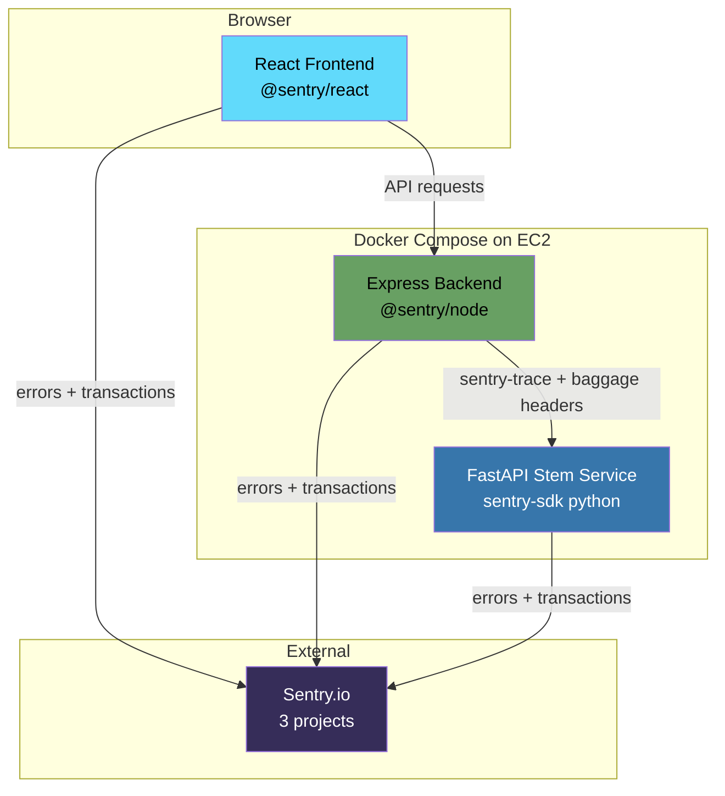
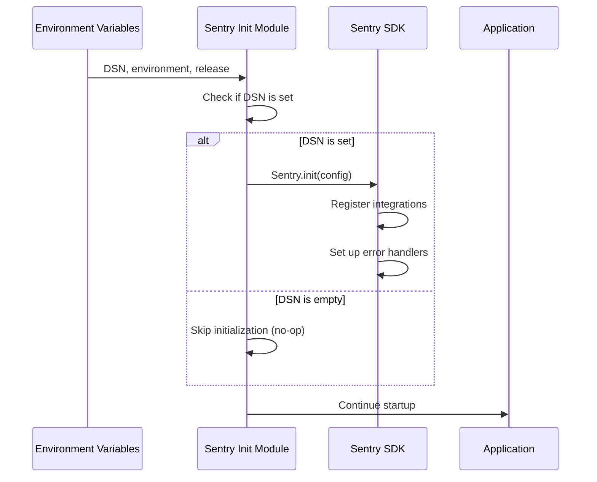
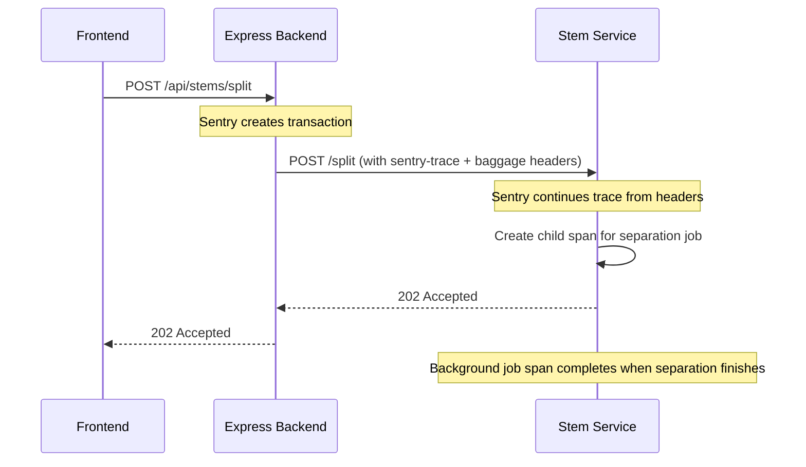

# Design Document: APM Monitoring

## Overview

This design integrates Sentry APM into the Burnt Beats production stack across three services: the React/Vite frontend, the Node.js/Express backend, and the Python FastAPI stem service. Each service initializes the Sentry SDK independently, reading configuration from environment variables. Distributed tracing connects backend requests to stem service calls, providing end-to-end visibility into stem separation workflows.

The integration follows a "thin wrapper" approach — each service gets a small initialization module that configures Sentry with appropriate defaults, data filtering, and tracing. The SDKs handle most instrumentation automatically (error capture, request tracing, Web Vitals), with custom spans added only for background job tracking in the stem service.

### Design Decisions

1. **Separate Sentry projects per service** — Each service (frontend, backend, stem-service) gets its own DSN. This provides independent rate limits, alert rules, and dashboards while still supporting cross-service trace correlation.
2. **Graceful degradation** — If no DSN is configured, all services operate normally without monitoring. No code paths change behavior based on Sentry availability.
3. **Source maps via Vite plugin** — The `@sentry/vite-plugin` uploads source maps during `vite build`, avoiding a separate CI step and keeping the build self-contained.
4. **Conservative sample rates** — Frontend 10%, backend 20%, stem service 30%. The stem service gets the highest rate because it has the lowest request volume and the most valuable performance data (ML inference times).

## Architecture



### Initialization Flow



### Distributed Tracing Flow



## Components and Interfaces

### Frontend Sentry Module

**File:** `frontend/src/lib/sentry.ts`

```typescript
// Initialization function — called once in main.tsx before React render
export function initSentry(): void;
```

**File:** `frontend/src/components/SentryErrorBoundary.tsx`

```typescript
// Wraps the app root to catch React render errors
export function SentryErrorBoundary(props: { children: React.ReactNode }): JSX.Element;
```

**File:** `frontend/vite.config.ts` (modified)

```typescript
// Add @sentry/vite-plugin for source map upload in production builds
```

**File:** `frontend/src/main.tsx` (modified)

```typescript
// Call initSentry() before createRoot/render
```

### Backend Sentry Module

**File:** `backend/sentry.js`

```javascript
// Initialization function — called at top of server.js before Express setup
export function initSentry();

// Sentry Express error handler — mounted after all routes
export function sentryErrorHandler();
```

**File:** `backend/server.js` (modified)

```javascript
// Import and call initSentry() at the very top
// Mount sentryErrorHandler() after all route handlers
```

### Stem Service Sentry Module

**File:** `stem_service/sentry_init.py`

```python
# Initialization function — called in FastAPI lifespan
def init_sentry() -> None: ...

# Context manager for creating job spans
def job_span(job_id: str, operation: str, **tags) -> Generator: ...
```

**File:** `stem_service/server.py` (modified)

```python
# Call init_sentry() at the start of the lifespan function
```

**File:** `stem_service/job_worker.py` (modified)

```python
# Wrap separation/expand logic in job_span() context manager
```

### Configuration Flow

| Service | DSN Variable | Where Set | When Read |
|---------|-------------|-----------|-----------|
| Frontend | `VITE_SENTRY_DSN` | docker-compose.yml build args | Build time (baked into bundle) |
| Backend | `SENTRY_DSN` | docker-compose.yml environment | Runtime (process.env) |
| Stem Service | `SENTRY_DSN` | docker-compose.yml environment | Runtime (os.environ) |

Additional configuration per service:

| Option | Frontend | Backend | Stem Service |
|--------|----------|---------|--------------|
| `tracesSampleRate` | 0.1 | 0.2 | 0.3 |
| `environment` | from `VITE_SENTRY_ENVIRONMENT` or "production" | from `NODE_ENV` | from `SENTRY_ENVIRONMENT` or "production" |
| `release` | from `VITE_SENTRY_RELEASE` or git SHA | from `SENTRY_RELEASE` or git SHA | from `SENTRY_RELEASE` or git SHA |
| `sendDefaultPii` | false | false | false |

### Source Map Upload Strategy

The frontend uses `@sentry/vite-plugin` integrated directly into `vite.config.ts`:

```mermaid
graph LR
    A[vite build] --> B[@sentry/vite-plugin]
    B --> C[Generate source maps]
    B --> D[Upload to Sentry]
    B --> E[Delete local .map files]
    
    style A fill:#646cff,color:#fff
    style D fill:#362d59,color:#fff
```

The plugin is configured to:
1. Generate source maps during build (override the current `sourcemap: false` for production)
2. Upload them to Sentry with the release tag
3. Delete the `.map` files from the output directory so they are never served to users

This requires `SENTRY_AUTH_TOKEN` and `SENTRY_ORG`/`SENTRY_PROJECT` environment variables available at build time (CI or Docker build).

### Data Filtering Approach

Each service implements a `beforeSend` or `beforeSendTransaction` hook to strip sensitive data:

**Backend** — Custom `beforeSend` strips headers:
- `Authorization` (Bearer tokens)
- `Cookie` (session data)
- `x-api-key` (API authentication)

**Stem Service** — Custom `before_send` strips headers:
- `X-Stem-Service-Token` (internal service auth)

**Frontend** — Configuration + `beforeBreadcrumb` hook:
- `sendDefaultPii: false` (no IP capture)
- `beforeBreadcrumb` strips Clerk session tokens and Stripe keys from XHR/fetch breadcrumb URLs and bodies

## Data Models

No new persistent data models are introduced. Sentry events are ephemeral and sent to the external Sentry service. The relevant data structures are:

### Sentry Configuration Object (per service)

```typescript
interface SentryConfig {
  dsn: string;
  environment: string;        // "production" | "development" | "staging"
  release: string;            // git SHA or version tag
  tracesSampleRate: number;   // 0.0 to 1.0
  sendDefaultPii: boolean;    // always false
  integrations: Integration[];
  beforeSend?: (event: Event) => Event | null;
  beforeBreadcrumb?: (breadcrumb: Breadcrumb) => Breadcrumb | null;
}
```

### Job Span Tags (Stem Service)

```python
@dataclass
class JobSpanTags:
    job_id: str
    operation: str        # "stem_separation" | "stem_expand"
    stem_count: int       # 2 | 4
    quality_mode: str     # "speed" | "balanced" | "quality" | "ultra"
    correlation_id: str   # from request header
```

## Correctness Properties

*A property is a characteristic or behavior that should hold true across all valid executions of a system — essentially, a formal statement about what the system should do. Properties serve as the bridge between human-readable specifications and machine-verifiable correctness guarantees.*

### Property 1: Backend sensitive header filtering

*For any* HTTP request object containing an arbitrary set of headers (including zero or more of Authorization, Cookie, and x-api-key), the backend's `beforeSend` filter SHALL produce an event where none of those sensitive headers appear in the request data, while all non-sensitive headers remain intact.

**Validates: Requirements 3.6, 8.1**

### Property 2: Stem service sensitive header filtering

*For any* HTTP request object containing an arbitrary set of headers (including zero or more instances of X-Stem-Service-Token), the stem service's `before_send` filter SHALL produce an event where the X-Stem-Service-Token header does not appear in the request data, while all other headers remain intact.

**Validates: Requirements 8.3**

### Property 3: Frontend breadcrumb data filtering

*For any* breadcrumb object whose URL or body contains strings matching Clerk session token patterns (e.g., `__session=...`) or Stripe publishable key patterns (e.g., `pk_live_...`, `pk_test_...`), the frontend's `beforeBreadcrumb` hook SHALL produce a breadcrumb where those sensitive values are redacted, while the breadcrumb's category, type, and non-sensitive data remain unchanged.

**Validates: Requirements 8.4**

## Error Handling

### Sentry Initialization Failures

- If `Sentry.init()` throws (e.g., invalid DSN format), the error is caught and logged to console/stdout. The application continues without monitoring.
- If the DSN is empty/undefined, initialization is skipped entirely — no SDK overhead.

### Network Failures to Sentry

- The Sentry SDK handles transport failures internally with retry logic and buffering.
- If Sentry is unreachable, events are dropped silently. No user-facing impact.
- The SDK never throws into application code from transport failures.

### Source Map Upload Failures

- If `@sentry/vite-plugin` cannot upload source maps (missing auth token, network error), the build still succeeds. Stack traces will show minified code but the app functions normally.
- The plugin logs warnings to build output for CI visibility.

### Circular Error Capture

- Sentry SDKs have built-in deduplication to prevent infinite loops if an error occurs within Sentry's own error handler.
- The `beforeSend` hook must not throw — if it does, Sentry drops the event and logs internally.

## Testing Strategy

### Unit Tests (Example-Based)

Unit tests verify specific configuration and initialization behavior:

| Test | Service | What it verifies |
|------|---------|-----------------|
| `initSentry` skips when no DSN | All 3 | Graceful degradation |
| `initSentry` calls SDK with correct config | All 3 | Configuration correctness |
| Error boundary renders fallback UI | Frontend | React error boundary behavior |
| `beforeSend` strips specific headers | Backend, Stem | Data filtering (specific examples) |
| `beforeBreadcrumb` strips tokens | Frontend | Breadcrumb filtering |
| Sample rates match defaults | All 3 | Configuration values |

### Property-Based Tests

Property-based tests verify universal data filtering guarantees using `fast-check` (frontend/backend) and `hypothesis` (stem service):

- **Property 1**: Generate random header maps with arbitrary keys/values, always including at least one sensitive header. Verify the filter removes exactly the sensitive headers and preserves everything else. (100+ iterations)
- **Property 2**: Generate random header maps for stem service requests. Verify X-Stem-Service-Token is always stripped. (100+ iterations)
- **Property 3**: Generate random breadcrumb objects with URLs/bodies containing Clerk and Stripe token patterns mixed with normal data. Verify tokens are redacted while structure is preserved. (100+ iterations)

**PBT Library Choices:**
- Frontend/Backend (TypeScript/JavaScript): `fast-check`
- Stem Service (Python): `hypothesis`

**Configuration:**
- Minimum 100 iterations per property test
- Each test tagged: `Feature: apm-monitoring, Property {N}: {title}`

### Integration Tests

Integration tests verify end-to-end Sentry behavior with mocked transport:

| Test | What it verifies |
|------|-----------------|
| Backend error handler sends event to mock transport | Error capture pipeline |
| Outbound request to stem service includes trace headers | Distributed tracing propagation |
| Stem service continues trace from incoming headers | Trace continuation |
| Background job failure creates Sentry event with job_id | Job error capture |

### What Is NOT Tested

- Sentry SDK internal behavior (already tested by Sentry)
- Actual network delivery to Sentry servers (use mock transport)
- Source map upload in CI (verified by checking build output logs)
- Web Vitals accuracy (browser-specific, tested by Sentry SDK)
