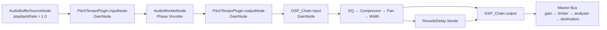
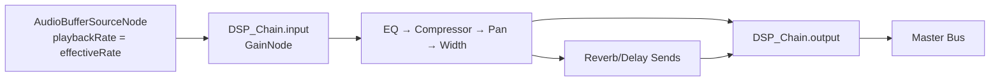
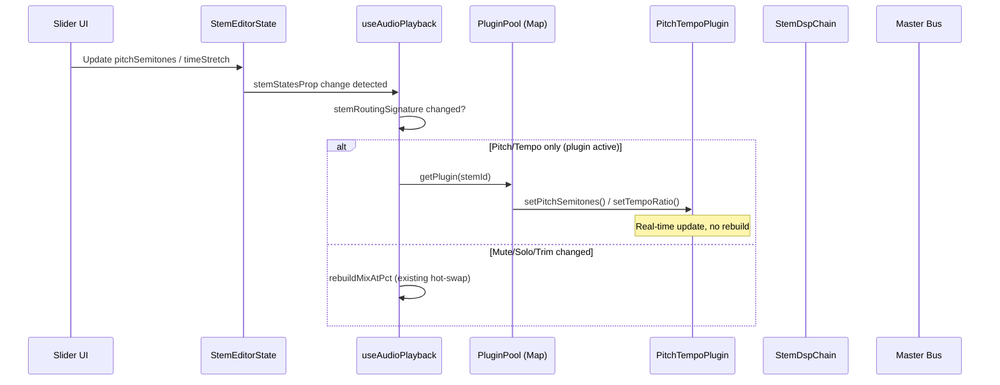

# Design Document: Pitch-Tempo Plugin Integration

## Overview

This design integrates the existing `PitchTempoPlugin` (a phase vocoder AudioWorklet) into the stem playback pipeline managed by `useAudioPlayback`. The goal is to replace the legacy coupled `playbackRate`-based pitch/tempo control with true independent pitch shifting and time stretching for live preview, while preserving the existing DSP chain (EQ, compressor, pan, width, reverb, delay) and export pipeline unchanged.

The integration uses the plugin's low-level `PitchTempoPlugin` class directly — not the widget or hook — wiring one instance per audible stem between the `AudioBufferSourceNode` and the existing `StemDspChain.input`. The existing `useAudioPlayback` orchestrator retains full control of playback lifecycle, seek, hot-swap, and playhead tracking.

### Key Design Decisions

1. **Per-stem plugin instances** — Each audible stem gets its own `PitchTempoPlugin` to allow independent pitch/tempo per stem (matching existing `StemEditorState` per-stem model).
2. **Lazy initialization with reuse** — Plugins are created on first play and reused across play/stop cycles via `plugin.reset()`, avoiding repeated worklet registration overhead.
3. **Real-time parameter updates** — Pitch and tempo changes call `plugin.setPitchSemitones()` / `plugin.setTempoRatio()` directly without source rebuild. Only trim changes or mute/solo toggling trigger the existing hot-swap rebuild.
4. **Source playbackRate = 1.0** — When the plugin is active, the `AudioBufferSourceNode.playbackRate` is set to unity since the plugin handles both pitch and tempo.
5. **Graceful fallback** — If worklet registration fails (CSP, browser), the system falls back to the legacy `playbackRate` approach with a console warning.
6. **Duration uses tempoRatio** — Wall-clock duration for playhead tracking uses `trimmedLength * timeStretch` (since `timeStretch > 1` means slower, mapping to `tempoRatio < 1`).

## Architecture

### Audio Graph Topology (per stem, plugin active)



### Audio Graph Topology (fallback, plugin unavailable)



### Component Interaction Diagram



## Components and Interfaces

### 1. Plugin Pool (`pluginPoolRef`)

A `Map<string, PitchTempoPlugin>` stored in a `useRef` within `useAudioPlayback`. Manages plugin lifecycle across play/stop cycles.

```typescript
// Inside useAudioPlayback
const pluginPoolRef = useRef<Map<string, PitchTempoPlugin>>(new Map());
const pluginAvailableRef = useRef<boolean | null>(null); // null = untested, true/false after first attempt
```

**Responsibilities:**
- Lazily create plugins on first playback request
- Reuse existing plugins across play/stop cycles (calling `reset()` between)
- Destroy all plugins on unmount
- Track whether plugin initialization succeeded (for fallback logic)

### 2. Plugin Lifecycle Functions

```typescript
/**
 * Get or create a PitchTempoPlugin for a stem.
 * Returns null if plugin system is unavailable (fallback mode).
 */
async function getOrCreatePlugin(
  ctx: AudioContext,
  stemId: string,
): Promise<PitchTempoPlugin | null> {
  // If we already know plugins don't work, skip
  if (pluginAvailableRef.current === false) return null;

  const pool = pluginPoolRef.current;
  const existing = pool.get(stemId);
  if (existing) {
    existing.reset();
    return existing;
  }

  try {
    const plugin = new PitchTempoPlugin({ audioContext: ctx });
    await plugin.ready();
    pool.set(stemId, plugin);
    pluginAvailableRef.current = true;
    return plugin;
  } catch (err) {
    console.warn('[useAudioPlayback] PitchTempoPlugin init failed, using legacy playbackRate:', err);
    pluginAvailableRef.current = false;
    return null;
  }
}

/**
 * Destroy all plugins in the pool and clear the map.
 */
function destroyAllPlugins(): void {
  pluginPoolRef.current.forEach((plugin) => plugin.destroy());
  pluginPoolRef.current.clear();
}
```

### 3. Modified `buildStemSource` Function

```typescript
/**
 * Build a stem source node with optional plugin insertion.
 * When plugin is available: source(rate=1.0) → plugin.inputNode, plugin.outputNode → dspInput
 * When plugin is null: source(rate=effectiveRate) → dspInput (legacy behavior)
 */
function buildStemSource(
  ctx: AudioContext,
  buffer: AudioBuffer,
  st: StemEditorState,
  trimStart: number,
  trimEnd: number,
  dspInput: AudioNode,
  plugin: PitchTempoPlugin | null,
): AudioBufferSourceNode {
  const source = ctx.createBufferSource();
  source.buffer = buffer;

  if (plugin) {
    // Plugin handles pitch + tempo — source runs at unity rate
    source.playbackRate.value = 1.0;
    source.connect(plugin.inputNode);
    (plugin.outputNode as AudioNode).connect(dspInput);
    // Apply current state to plugin
    plugin.setPitchSemitones(st.pitchSemitones);
    plugin.setTempoRatio(timeStretchToTempoRatio(st.timeStretch));
  } else {
    // Legacy: coupled pitch+tempo via playbackRate
    source.playbackRate.value = getStemEffectiveRate(st);
    source.connect(dspInput);
  }

  source.start(0, trimStart, trimEnd - trimStart);
  return source;
}
```

### 4. State-to-Plugin Mapping Functions

```typescript
/**
 * Convert StemEditorState.timeStretch to plugin tempoRatio.
 * 
 * timeStretch semantics: 1.0 = normal, 0.85 = 85% of original duration (faster), 1.15 = 115% (slower)
 * tempoRatio semantics: 1.0 = normal, 1.15 = 15% faster, 0.85 = 15% slower
 * 
 * Mapping: tempoRatio = 1 / timeStretch
 * - timeStretch 0.85 → tempoRatio 1/0.85 ≈ 1.176 (faster playback)
 * - timeStretch 1.15 → tempoRatio 1/1.15 ≈ 0.870 (slower playback)
 * 
 * The plugin clamps to [0.85, 1.15] internally.
 */
function timeStretchToTempoRatio(timeStretch: number): number {
  if (timeStretch <= 0) return 1.0;
  return 1.0 / timeStretch;
}
```

### 5. Modified `MixStemRuntime` Type

```typescript
export type MixStemRuntime = {
  stemId: string;
  dsp: StemDspChain;
  source: AudioBufferSourceNode;
  plugin: PitchTempoPlugin | null; // null when in fallback mode
};
```

### 6. Real-Time Parameter Sync (Hot-Swap Optimization)

The existing `stemRoutingSignature` includes pitch and timeStretch, triggering a full rebuild on change. With the plugin, we intercept pitch/tempo changes and apply them directly without rebuild:

```typescript
// In the useEffect that watches stemStatesProp for hot-swap:
// Before triggering rebuildMixAtPct for routing changes,
// check if ONLY pitch/tempo changed (not mute/solo):

function stemPitchTempoSignature(states: Record<string, StemEditorState>, stemIds: string[]): string {
  return stemIds
    .map((id) => {
      const s = states[id] ?? defaultStemState();
      return `${id}:p${s.pitchSemitones}ts${s.timeStretch}`;
    })
    .join("|");
}

function stemMuteSoloSignature(states: Record<string, StemEditorState>, stemIds: string[]): string {
  return stemIds
    .map((id) => {
      const s = states[id] ?? defaultStemState();
      return `${id}:m${s.muted ? 1 : 0}s${s.soloed ? 1 : 0}`;
    })
    .join("|");
}
```

When only pitch/tempo changed and plugins are active, update plugins in-place:

```typescript
// Inside the hot-swap useEffect:
if (onlyPitchTempoChanged && pluginAvailableRef.current) {
  for (const r of mixStemRuntimesRef.current) {
    if (r.plugin) {
      const st = stemStatesProp[r.stemId];
      if (st) {
        r.plugin.setPitchSemitones(st.pitchSemitones);
        r.plugin.setTempoRatio(timeStretchToTempoRatio(st.timeStretch));
      }
    }
  }
  // Update duration tracking since tempo affects wall-clock time
  // Recalculate mixDurationRef and adjust playhead tracker
  return; // Skip full rebuild
}
```

### 7. Duration Calculation Updates

```typescript
/**
 * Wall-clock duration of the trimmed region.
 * When plugin is active: duration = trimmedLength * timeStretch
 *   (timeStretch > 1 means slower, so longer wall time)
 * When plugin is inactive (legacy): duration = trimmedLength / effectiveRate
 */
export function getStemTrimWallDurationSeconds(
  buffer: AudioBuffer,
  st: StemEditorState,
  usePlugin: boolean = false,
): number {
  const { trimStart, trimEnd } = trimToSeconds(buffer, st.trim);
  const len = trimEnd - trimStart;
  if (len <= 0) return 0;

  if (usePlugin) {
    // Plugin mode: source runs at 1.0, plugin handles tempo
    // Wall duration = buffer duration * timeStretch
    // (timeStretch=1.15 means 15% slower → 15% longer wall time)
    return len * (st.timeStretch ?? 1.0);
  }

  // Legacy mode: playbackRate = effectiveRate
  return len / getStemEffectiveRate(st);
}
```

### 8. Seek Offset Calculation Update

```typescript
/**
 * Buffer offset for seeking when plugin is active.
 * Since source runs at playbackRate=1.0, buffer time = wall time / timeStretch.
 */
export function trimStartOffsetAtElapsedWall(
  buffer: AudioBuffer,
  st: StemEditorState,
  elapsedWallSeconds: number,
  usePlugin: boolean = false,
): { trimStart: number; trimEnd: number; startOffset: number } {
  const { trimStart, trimEnd } = trimToSeconds(buffer, st.trim);
  const trimLen = trimEnd - trimStart;
  if (trimLen <= 0) return { trimStart, trimEnd, startOffset: trimStart };

  if (usePlugin) {
    // Plugin mode: buffer advances at 1/timeStretch rate relative to wall clock
    // bufferElapsed = wallElapsed / timeStretch
    const stretch = st.timeStretch ?? 1.0;
    const delta = Math.min(trimLen, elapsedWallSeconds / stretch);
    return { trimStart, trimEnd, startOffset: trimStart + delta };
  }

  // Legacy mode
  const rate = getStemEffectiveRate(st);
  const delta = Math.min(trimLen, elapsedWallSeconds * rate);
  return { trimStart, trimEnd, startOffset: trimStart + delta };
}
```

### 9. Cleanup on Stop

```typescript
function stopMixStemRuntime(r: MixStemRuntime) {
  try { r.source.stop(); } catch { /* already stopped */ }
  try { r.source.disconnect(); } catch { /* already disconnected */ }
  if (r.plugin) {
    // Disconnect plugin from DSP chain but DON'T destroy — reuse later
    try { (r.plugin.outputNode as AudioNode).disconnect(); } catch {}
    // Don't disconnect inputNode — source already disconnected above
  }
  r.dsp.disconnect();
}
```

### 10. Package Installation

The plugin is consumed as a local file dependency in `frontend/package.json`:

```json
{
  "dependencies": {
    "pitch-plugin": "file:./src/components/multi-stem-editor/pitch-tempo-plugin"
  }
}
```

This allows importing directly:
```typescript
import { PitchTempoPlugin, PARAM_META } from 'pitch-plugin';
```

## Data Models

### StemEditorState (unchanged)

```typescript
interface StemEditorState {
  trim: TrimState;
  mixer: MixerState;
  rate: number;              // Legacy, used only for old saves
  pitchSemitones: number;   // -3 to +3 (plugin range)
  timeStretch: number;      // 0.85 to 1.15
  muted: boolean;
  soloed: boolean;
}
```

### MixStemRuntime (extended)

```typescript
type MixStemRuntime = {
  stemId: string;
  dsp: StemDspChain;
  source: AudioBufferSourceNode;
  plugin: PitchTempoPlugin | null;
};
```

### Plugin Pool State

```typescript
// Ref-based (no React re-renders needed)
pluginPoolRef: Map<string, PitchTempoPlugin>  // stemId → plugin instance
pluginAvailableRef: boolean | null             // null=untested, true=works, false=fallback
```

### Parameter Mapping Summary

| StemEditorState field | Plugin method | Conversion |
|---|---|---|
| `pitchSemitones` | `plugin.setPitchSemitones(value)` | Direct pass-through |
| `timeStretch` | `plugin.setTempoRatio(1/value)` | Inverse: `tempoRatio = 1 / timeStretch` |

### UI Slider Ranges (updated)

| Slider | Min | Max | Step | Display |
|---|---|---|---|---|
| Pitch | -3 | +3 | 0.1 | `±X.X st` |
| Tempo | 0.85 | 1.15 | 0.01 | `-15%` to `+15%` |


## Correctness Properties

*A property is a characteristic or behavior that should hold true across all valid executions of a system — essentially, a formal statement about what the system should do. Properties serve as the bridge between human-readable specifications and machine-verifiable correctness guarantees.*

### Property 1: timeStretch to tempoRatio Inverse Conversion

*For any* valid `timeStretch` value in (0, ∞), `timeStretchToTempoRatio(timeStretch)` SHALL equal `1.0 / timeStretch`, and for any `timeStretch` in [0.85, 1.15], the resulting `tempoRatio` SHALL fall within the plugin's accepted range [0.85, 1.15] (after the plugin's internal clamping).

**Validates: Requirements 3.1, 5.2**

### Property 2: Pitch Value Clamping

*For any* numeric pitch value (including values outside [-3, 3]), after calling `plugin.setPitchSemitones(value)`, the plugin's internal `pitchSemitones` SHALL be clamped to `max(-3, min(3, value))`.

**Validates: Requirements 2.2**

### Property 3: Tempo Ratio Clamping

*For any* numeric tempo ratio value (including values outside [0.85, 1.15]), after calling `plugin.setTempoRatio(value)`, the plugin's internal `tempoRatio` SHALL be clamped to `max(0.85, min(1.15, value))`.

**Validates: Requirements 3.2**

### Property 4: Legacy Effective Rate Formula Preservation

*For any* `StemEditorState` with `pitchSemitones` in [-12, 12] and `timeStretch` in (0, 2], `getStemEffectiveRate(state)` SHALL return `2^(pitchSemitones/12) / timeStretch`, ensuring the export pipeline continues to produce correct coupled-rate values.

**Validates: Requirements 5.3, 9.1**

### Property 5: Plugin-Mode Wall-Clock Duration

*For any* `AudioBuffer` with positive duration, any `TrimState` where `start < end`, and any `timeStretch` in [0.85, 1.15], `getStemTrimWallDurationSeconds(buffer, state, usePlugin=true)` SHALL equal `(trimEnd - trimStart) * timeStretch`, where `trimStart` and `trimEnd` are the sample-accurate trim boundaries.

**Validates: Requirements 7.1, 7.2**

### Property 6: Plugin-Mode Seek Offset Consistency

*For any* `AudioBuffer`, `StemEditorState` with `timeStretch` in [0.85, 1.15], and `elapsedWallSeconds` in [0, wallDuration], `trimStartOffsetAtElapsedWall(buffer, state, elapsed, usePlugin=true)` SHALL return a `startOffset` equal to `trimStart + (elapsedWall / timeStretch)`, capped at `trimEnd`. Furthermore, when `elapsedWall` equals the full wall duration, `startOffset` SHALL equal `trimEnd`.

**Validates: Requirements 7.3**

### Property 7: Duration-Seek Round Trip

*For any* valid stem configuration (buffer + trim + timeStretch), if `wallDuration = getStemTrimWallDurationSeconds(buffer, state, true)` and we seek to `elapsedWall = wallDuration`, then `trimStartOffsetAtElapsedWall(buffer, state, wallDuration, true).startOffset` SHALL equal `trimEnd` (the end of the trimmed region). This ensures the playhead reaches exactly 100% when the full duration elapses.

**Validates: Requirements 7.1, 7.3**

### Property 8: Routing Signature Sensitivity

*For any* two `StemEditorState` objects that differ only in `pitchSemitones` or `timeStretch`, `stemRoutingSignature()` SHALL produce different signature strings, ensuring the hot-swap mechanism detects the change.

**Validates: Requirements 5.4, 6.1**

## Error Handling

### Plugin Initialization Failure

| Failure Mode | Detection | Recovery |
|---|---|---|
| AudioWorklet `addModule` rejects (CSP `blob:` blocked) | `plugin.ready()` promise rejects or `_init()` catch block fires | Set `pluginAvailableRef = false`, fall back to legacy `playbackRate` for all subsequent playback. Log warning. |
| AudioContext limit reached | `new AudioContext()` throws | Handled by existing `useAudioContext` — shared context avoids this. |
| Worklet node creation fails | `new AudioWorkletNode()` throws inside `_init()` | Plugin's internal fallback: `inputNode` connects directly to `outputNode` (passthrough). Plugin reports ready. |

### Runtime Errors

| Failure Mode | Detection | Recovery |
|---|---|---|
| `setPitchSemitones` / `setTempoRatio` throws | try/catch around parameter update in hot-swap effect | Trigger full `rebuildMixAtPct` (existing hot-swap fallback). |
| Plugin node disconnects unexpectedly | `source.onended` fires prematurely | Existing `onended` handler cleans up runtime. Next play creates fresh connections. |
| `plugin.reset()` fails | try/catch around reset call | Destroy and recreate plugin instance for that stem. |

### Graceful Degradation Strategy

```typescript
// Pseudocode for the fallback decision tree
if (pluginAvailableRef.current === null) {
  // First attempt — try to create plugin
  const plugin = await tryCreatePlugin(ctx, stemId);
  if (plugin) {
    pluginAvailableRef.current = true;
    // Use plugin path
  } else {
    pluginAvailableRef.current = false;
    // Use legacy path for this and all future playback
  }
} else if (pluginAvailableRef.current === false) {
  // Known failure — skip plugin entirely
  // Use legacy playbackRate path
} else {
  // Plugin works — reuse from pool
  const plugin = pool.get(stemId);
  plugin.reset();
  // Use plugin path
}
```

### User-Facing Error Communication

- Plugin failure is **silent** to the user — the audio still plays correctly via the legacy path.
- A `console.warn` is emitted for developer visibility.
- No toast/modal/error UI is shown since the fallback is functionally equivalent (just with coupled pitch/tempo).

## Testing Strategy

### Unit Tests (Vitest)

Focus on pure functions that can be tested without Web Audio API:

| Function | Test Cases |
|---|---|
| `timeStretchToTempoRatio()` | Normal values, edge values (0.85, 1.0, 1.15), zero/negative input |
| `getStemTrimWallDurationSeconds()` (plugin mode) | Various trim/stretch combos, zero-length trim, boundary values |
| `trimStartOffsetAtElapsedWall()` (plugin mode) | Seek to 0%, 50%, 100%, beyond 100% |
| `getStemEffectiveRate()` | Verify unchanged behavior (regression) |
| `stemRoutingSignature()` | Verify pitch/tempo included, changes detected |
| `stemPitchTempoSignature()` | New helper — verify correct extraction |

### Property-Based Tests (Vitest + fast-check)

The project uses Vitest. Property tests will use `fast-check` for generation.

**Configuration:**
- Minimum 100 iterations per property
- Each test tagged with property reference comment

```typescript
// Example structure
import { fc } from '@fast-check/vitest';

describe('pitch-tempo-plugin-integration properties', () => {
  // Feature: pitch-tempo-plugin-integration, Property 1: timeStretch to tempoRatio inverse conversion
  it.prop([fc.double({ min: 0.1, max: 5.0, noNaN: true })], { numRuns: 100 })(
    'timeStretchToTempoRatio is inverse of timeStretch',
    (timeStretch) => {
      expect(timeStretchToTempoRatio(timeStretch)).toBeCloseTo(1.0 / timeStretch);
    }
  );
});
```

### Integration Tests

| Scenario | Approach |
|---|---|
| Plugin wiring in audio graph | Mock AudioContext + verify connect() call order |
| Hot-swap without rebuild | Mock plugin, change pitch, verify no source.stop() |
| Fallback on init failure | Mock `audioWorklet.addModule` to reject, verify legacy path |
| Lifecycle (mount/unmount) | Render hook, unmount, verify destroy() called |
| Reuse across play/stop | Play, stop, play — verify same plugin instance, reset() called |

### Manual Testing Checklist

1. Play stem → adjust pitch slider → hear pitch change without speed change
2. Play stem → adjust tempo slider → hear speed change without pitch change
3. Play mix → adjust one stem's pitch → other stems unaffected
4. Stop → Play again → no audio artifacts (reset works)
5. Rapid slider dragging → no clicks or dropouts
6. Mount/unmount editor repeatedly → no console errors about AudioContext
7. Export stem with pitch/tempo → verify exported file uses legacy rate (shorter/longer duration)
