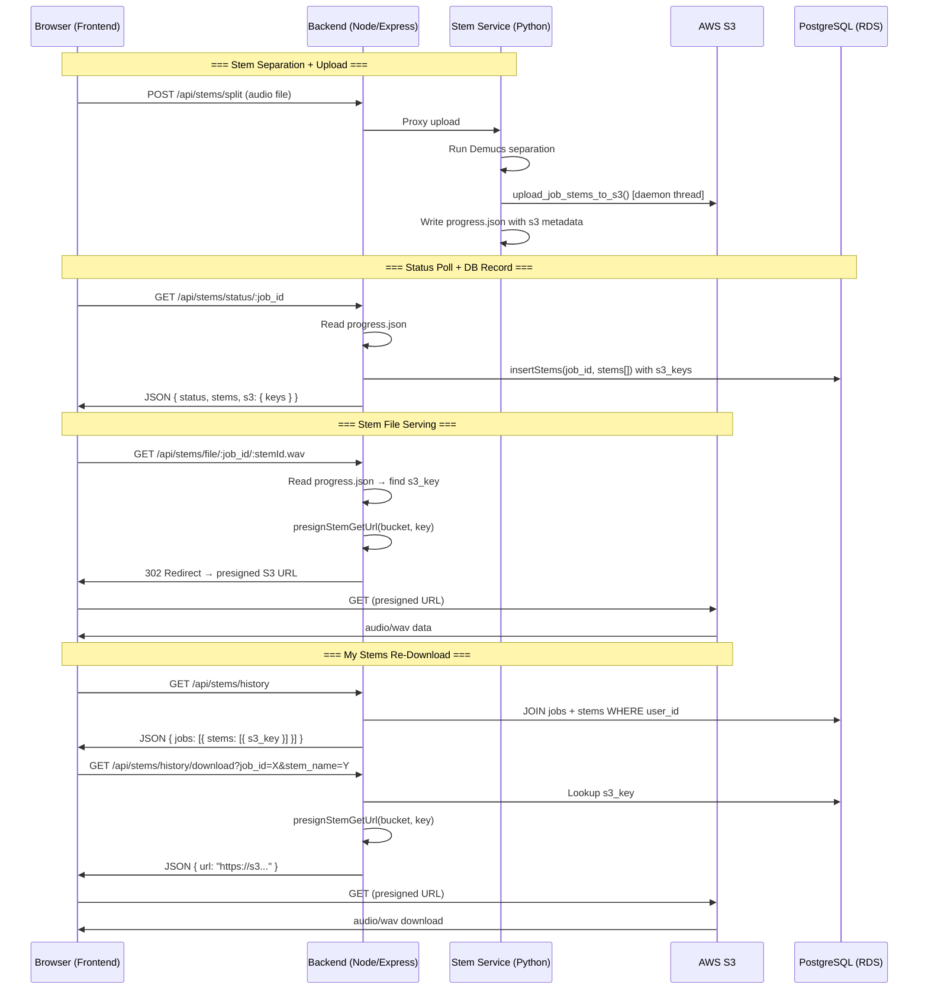
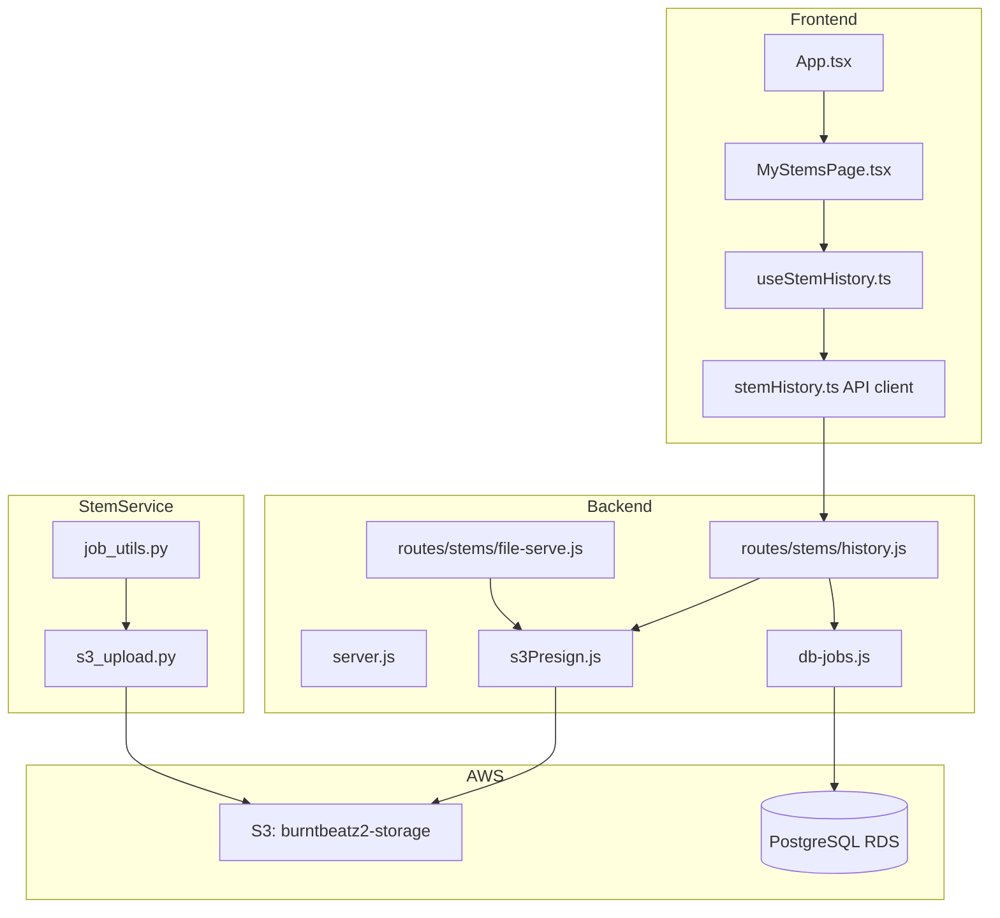

# Design Document: S3 Storage Activation

## Overview

This design covers the end-to-end activation of the existing S3 storage pipeline in BurntBeats, plus a new user-facing "My Stems" page for browsing and re-downloading previously separated stems. The infrastructure is already built across three services (Python stem_service uploads, Node backend presigns, frontend follows redirects). This spec activates it in production and adds the history/re-download UI.

The work breaks into two logical halves:
1. **Pipeline activation** (Phases 1–6): Environment config, CORS, DB migration, testing, deployment, optimization — primarily ops/config work with minimal new code.
2. **My Stems Page** (Phase 7): New backend route, frontend page, and supporting hooks — the bulk of new application code.

---

## Architecture

### High-Level Data Flow



### Component Interaction Map



---

## Components and Interfaces

### Backend: New Route — `GET /api/stems/history`

**File:** `backend/routes/stems/history.js`

Returns the authenticated user's completed jobs with nested stem metadata.

```typescript
// Request
GET /api/stems/history?limit=50&offset=0
Headers: { Authorization: "Bearer <clerk_token>" }

// Response 200
{
  jobs: Array<{
    job_id: string;           // UUID
    status: "completed" | "failed" | "cancelled";
    stems: number;            // 2 or 4
    quality: string | null;
    original_filename: string | null;
    duration_seconds: number | null;
    token_cost: number;
    model_name: string | null;
    created_at: string;       // ISO 8601
    completed_at: string | null;
    stem_files: Array<{
      stem_name: string;      // vocals, drums, bass, other, instrumental
      s3_key: string | null;  // null = upload incomplete
      file_size_bytes: number | null;
    }>;
  }>;
  total: number;              // total job count for pagination
}
```

**Auth:** Clerk JWT verification via `verifyClerkBearer()`. Returns 401 if unauthenticated.

**Query:** Single SQL query joining `jobs` and `stems` tables, filtered by `clerk_user_id`, ordered by `created_at DESC`.

### Backend: New Route — `GET /api/stems/history/download`

**File:** `backend/routes/stems/history.js`

Generates a fresh presigned URL for a specific stem belonging to the authenticated user.

```typescript
// Request
GET /api/stems/history/download?job_id=<UUID>&stem_name=<string>
Headers: { Authorization: "Bearer <clerk_token>" }

// Response 200
{ url: "https://burntbeatz2-storage.s3.us-east-1.amazonaws.com/..." }

// Response 404
{ error: "Stem not found or not available for download" }

// Response 500
{ error: "Failed to generate download URL" }
```

**Security:** Verifies the job belongs to the authenticated user before generating the presigned URL. Prevents cross-user data leakage.

### Backend: New DB Function — `getJobHistoryWithStems()`

**File:** `backend/db-jobs.js`

```javascript
/**
 * Get job history with nested stem metadata for a user.
 * @param {string} clerkUserId
 * @param {{ limit?: number, offset?: number }} [opts]
 * @returns {Promise<{ jobs: Array<Record<string, unknown>>, total: number }>}
 */
export async function getJobHistoryWithStems(clerkUserId, opts = {}) {
  // Query 1: Get total count
  // Query 2: Get jobs with LEFT JOIN stems, grouped by job
  // Returns jobs array with nested stem_files array
}
```

This is a new function (not modifying existing `getJobHistory`) to avoid breaking existing callers.

### Frontend: `MyStemsPage.tsx`

**File:** `frontend/src/components/MyStemsPage.tsx`

Top-level page component with these sections:
1. **Storage Overview** — stats cards (total jobs, total stems, storage used)
2. **Search + Sort Controls** — text input for filename filter, dropdown for sort
3. **Job Cards List** — expandable cards, each showing job metadata and nested stems

```typescript
interface MyStemsPageProps {
  onClose: () => void;  // Navigate back to editor
}
```

### Frontend: `useStemHistory.ts` Hook

**File:** `frontend/src/hooks/useStemHistory.ts`

```typescript
interface StemHistoryJob {
  job_id: string;
  status: string;
  stems: number;
  quality: string | null;
  original_filename: string | null;
  duration_seconds: number | null;
  token_cost: number;
  model_name: string | null;
  created_at: string;
  completed_at: string | null;
  stem_files: StemFileRecord[];
}

interface StemFileRecord {
  stem_name: string;
  s3_key: string | null;
  file_size_bytes: number | null;
}

interface UseStemHistoryReturn {
  jobs: StemHistoryJob[];
  isLoading: boolean;
  error: string | null;
  totalJobs: number;
  totalStems: number;
  totalStorageBytes: number;
  refetch: () => void;
}
```

Fetches on mount, caches in state. Exposes computed stats for the storage overview.

### Frontend: `stemHistory.ts` API Client

**File:** `frontend/src/api/stemHistory.ts`

```typescript
export async function fetchStemHistory(opts?: { limit?: number; offset?: number }): Promise<StemHistoryResponse>;
export async function fetchStemDownloadUrl(jobId: string, stemName: string): Promise<string>;
```

Uses `authHeaders()` from existing `api/auth.ts` for Clerk token injection.

---

## Data Models

### Existing Tables (No Changes)

**`jobs`** — already has all needed columns (job_id, clerk_user_id, status, stems, quality, original_filename, duration_seconds, token_cost, model_name, created_at, completed_at).

**`stems`** — already has the schema needed:
```sql
stems (
  id UUID PRIMARY KEY,
  job_id UUID REFERENCES jobs(job_id),
  stem_name TEXT NOT NULL,
  s3_key TEXT,
  file_size_bytes BIGINT,
  created_at TIMESTAMPTZ,
  UNIQUE (job_id, stem_name)  -- added by migration 001
)
```

### New Query: Job History with Stems

```sql
-- Count total jobs for user
SELECT COUNT(*) FROM jobs WHERE clerk_user_id = $1 AND status = 'completed';

-- Get jobs with stems
SELECT 
  j.job_id, j.status, j.stems, j.quality, j.original_filename,
  j.duration_seconds, j.token_cost, j.model_name, j.created_at, j.completed_at,
  COALESCE(
    json_agg(
      json_build_object(
        'stem_name', s.stem_name,
        's3_key', s.s3_key,
        'file_size_bytes', s.file_size_bytes
      )
    ) FILTER (WHERE s.id IS NOT NULL),
    '[]'::json
  ) AS stem_files
FROM jobs j
LEFT JOIN stems s ON s.job_id = j.job_id
WHERE j.clerk_user_id = $1 AND j.status = 'completed'
GROUP BY j.job_id
ORDER BY j.created_at DESC
LIMIT $2 OFFSET $3;
```

### Frontend State Model

```typescript
type SortOption = "date-desc" | "date-asc" | "name-asc" | "name-desc" | "stems-desc";

interface MyStemsState {
  jobs: StemHistoryJob[];
  searchQuery: string;
  sortBy: SortOption;
  expandedJobId: string | null;
  isDownloading: Record<string, boolean>;  // keyed by `${job_id}:${stem_name}`
}
```

---

## Correctness Properties

*A property is a characteristic or behavior that should hold true across all valid executions of a system — essentially, a formal statement about what the system should do. Properties serve as the bridge between human-readable specifications and machine-verifiable correctness guarantees.*

### Property 1: Upsert preserves latest S3 key

*For any* job_id, stem_name, and two distinct s3_key values (key_a, key_b), inserting a stem record with key_a and then upserting with key_b SHALL result in the stored s3_key being key_b.

**Validates: Requirements 3.2**

### Property 2: S3 key pattern correctness

*For any* valid job_id (UUID) and stem filename, the generated S3 key SHALL match the pattern `{prefix}/{job_id}/stems/{filename}` where prefix is the configured S3_PREFIX value.

**Validates: Requirements 4.1**

### Property 3: ZIP bundle completeness

*For any* set of stem files associated with a job, when "Download All" creates a ZIP bundle, the ZIP SHALL contain exactly one entry for each stem in the set, and no additional entries beyond an optional master mix.

**Validates: Requirements 7.4**

### Property 4: Storage stats invariant

*For any* collection of jobs with associated stems, the computed total_stems count SHALL equal the sum of stem_files.length across all jobs, and the computed total_storage_bytes SHALL equal the sum of all non-null file_size_bytes values.

**Validates: Requirements 7.5**

### Property 5: Search filter correctness

*For any* search query string and collection of jobs, the filtered result SHALL contain exactly those jobs whose original_filename contains the query as a case-insensitive substring, and no others.

**Validates: Requirements 7.6**

### Property 6: Sort ordering correctness

*For any* collection of jobs and any supported sort option, the sorted result SHALL be totally ordered according to the sort comparator: date-desc (newest first), date-asc (oldest first), name-asc (A→Z), name-desc (Z→A), stems-desc (most stems first).

**Validates: Requirements 7.1, 7.7**

### Property 7: Presigned URL generation from stored key

*For any* valid s3_key string stored in the stems table, calling the presigned URL generator SHALL produce a URL containing the bucket name and the s3_key path, with a valid expiration parameter.

**Validates: Requirements 6.6**

---

## Error Handling

### S3 Upload Failures (Stem Service)

| Scenario | Behavior | User Impact |
|----------|----------|-------------|
| boto3 not installed | Log warning, skip upload | Stems served from disk |
| S3_BUCKET not set | Log warning, skip upload | Stems served from disk |
| Network timeout to S3 | Log error with job_id | Stems served from disk; s3_key remains null |
| Partial upload (some stems fail) | Log partial failure, record successful keys | Some stems available from S3, others from disk |
| Daemon thread killed (container restart) | Upload lost silently | Stems served from disk |

### Presigned URL Failures (Backend)

| Scenario | Behavior | User Impact |
|----------|----------|-------------|
| S3 credentials expired | Catch error, fall back to disk streaming | Transparent to user (file-serve route) |
| s3_key not found in progress.json | Serve from disk | Transparent to user |
| Presigned URL expired (>3600s) | S3 returns 403 | Frontend shows "Download temporarily unavailable" toast |
| Presign fails on history/download route | Return 500 with error message | Frontend shows toast notification |

### My Stems Page Errors

| Scenario | Behavior | User Impact |
|----------|----------|-------------|
| History API returns 401 | Redirect to sign-in or show auth error | "Please sign in to view your stems" |
| History API returns 500 | Show error state with retry button | "Failed to load stem history. Try again." |
| No completed jobs | Show empty state | "No stems yet. Split your first track!" |
| Individual download fails | Toast notification | "Download failed for {stem_name}. Try again." |
| ZIP generation fails (memory) | Catch error, show toast | "ZIP creation failed. Try downloading stems individually." |
| Network error during fetch | Show error with retry | "Connection error. Check your network." |

### Graceful Degradation Strategy

The system follows a **progressive enhancement** model:
1. **S3 available + s3_key present** → Presigned URL redirect (fastest, offloads bandwidth)
2. **S3 unavailable but local file exists** → Stream from disk (fallback)
3. **Neither available** → 404 with clear error message

This means the system never hard-fails due to S3 issues — it degrades to disk serving.

---

## Testing Strategy

### Unit Tests (Example-Based)

Focus on specific scenarios and edge cases:

- **Backend route auth**: Verify 401 for unauthenticated requests to `/api/stems/history`
- **Cross-user isolation**: Verify user A cannot access user B's stems via history endpoint
- **Null s3_key handling**: Verify download endpoint returns 404 for stems without s3_key
- **Fallback behavior**: Verify file-serve falls back to disk when presign fails
- **Empty state**: Verify history returns empty array for users with no jobs
- **Migration idempotency**: Run migration twice, verify no error
- **insertStems with null pool**: Verify graceful no-op

### Property-Based Tests

**Library:** [fast-check](https://github.com/dubzzz/fast-check) (already available in the Node.js ecosystem, pairs with the existing Jest/Vitest test setup)

**Configuration:** Minimum 100 iterations per property test.

Each property test references its design document property:

| Property | Test File | What's Generated |
|----------|-----------|-----------------|
| Property 1: Upsert | `backend/tests/db-jobs.property.test.mjs` | Random UUIDs, stem names, s3 key strings |
| Property 2: S3 key pattern | `stem_service/tests/test_s3_key_pattern.py` | Random UUIDs, filenames |
| Property 3: ZIP completeness | `frontend/src/hooks/__tests__/useStemHistory.property.test.ts` | Random stem arrays |
| Property 4: Stats invariant | `frontend/src/hooks/__tests__/useStemHistory.property.test.ts` | Random job/stem collections |
| Property 5: Search filter | `frontend/src/components/__tests__/MyStemsPage.property.test.ts` | Random filenames, search queries |
| Property 6: Sort ordering | `frontend/src/components/__tests__/MyStemsPage.property.test.ts` | Random job collections, sort options |
| Property 7: Presigned URL | `backend/tests/s3-presign.property.test.mjs` | Random s3 key strings |

**Tag format:** `Feature: s3-storage-activation, Property {N}: {title}`

### Integration Tests

- **End-to-end S3 pipeline**: Upload → separate → S3 upload → presign → redirect → download
- **CORS verification**: Preflight request from production origin
- **Database migration**: Run on test DB, verify constraint
- **History endpoint with real data**: Insert jobs + stems, query, verify JOIN

### Frontend Component Tests

- **MyStemsPage rendering**: Verify cards render with correct data
- **Expand/collapse**: Verify stem rows appear on card expansion
- **Download button states**: Verify disabled state for null s3_key stems
- **Responsive layout**: Verify single-column on mobile viewport
- **Empty state**: Verify CTA shown when no jobs exist

---

## Security Considerations

### Authentication & Authorization

- All history endpoints require Clerk JWT verification (`verifyClerkBearer`)
- The download endpoint verifies job ownership: `WHERE clerk_user_id = $userId AND job_id = $jobId`
- No cross-user data leakage: a user can only see and download their own stems
- Presigned URLs are time-limited (default 3600s) — even if leaked, they expire

### Presigned URL Security

- URLs are generated server-side; the client never has AWS credentials
- Each URL is scoped to a single S3 object (one stem file)
- Expiry is configurable via `S3_PRESIGN_EXPIRES_SECONDS` env var
- URLs are generated fresh on each download request (not cached)

### Input Validation

- `job_id` validated against UUID regex before any DB query
- `stem_name` validated against allowed values (vocals, drums, bass, other, instrumental)
- `limit` clamped to max 200, `offset` clamped to min 0
- SQL queries use parameterized statements (no string interpolation)

### Docker Compose Fix

The duplicate `S3_BUCKET` and `S3_PREFIX` keys in the backend environment section must be removed. YAML maps with duplicate keys have undefined behavior — some parsers take the last value, others error. The fix removes the second occurrence.
