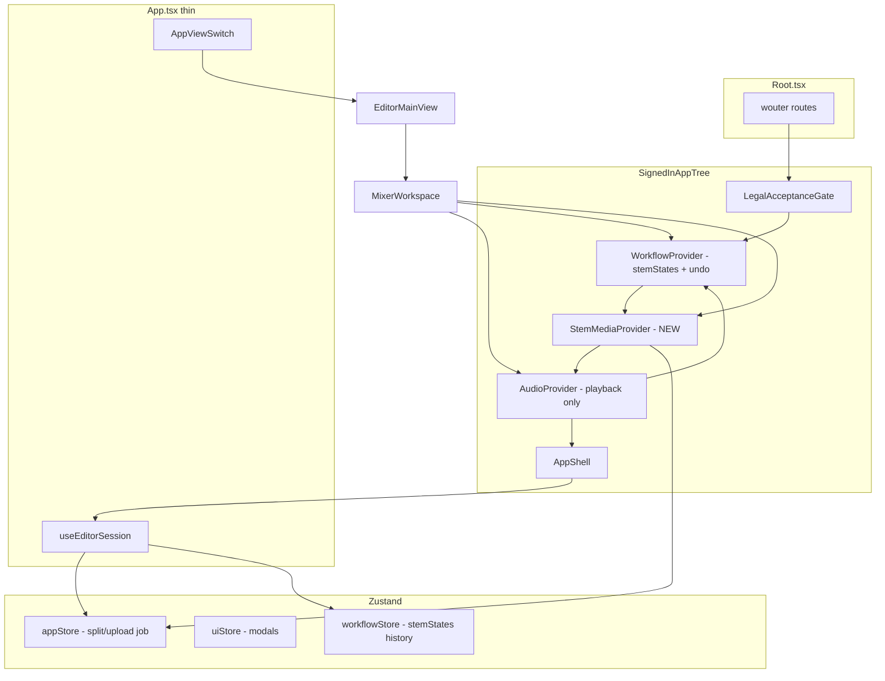

# Frontend Architecture Refactor Implementation Plan

> **For agentic workers:** REQUIRED SUB-SKILL: Use superpowers:subagent-driven-development (recommended) or superpowers:executing-plans to implement this plan task-by-task. Steps use checkbox (`- [ ]`) syntax for tracking.

**Goal:** Reduce `App.tsx` orchestration weight, eliminate duplicate stem-loading/audio state, retire dead editor paths, and establish a single data-flow contract for the DJ editor workstation.

**Architecture:** Introduce a **Stem Media layer** (one `useStemLoading` + one `AudioContext`) owned by providers; move editor orchestration into `useEditorSession` + thin `App.tsx`; consolidate undo/history into `workflowStore` (already tested, unused in prod); delete unreachable `MultiStemEditor` / `LayoutModeContext` toggles; shrink prop-drilling via store selectors and feature hooks.

**Tech Stack:** React 19, TypeScript, Vite 7, Zustand, Vitest, Playwright, Web Audio API, wouter.

---

## Current problems (verified in code)

| Issue | Evidence | Risk |
|-------|----------|------|
| **Double stem decode** | `WorkflowProvider` and `App.tsx` both call `useStemLoading` with separate `audioContextRef` instances (`WorkflowContext.tsx:44`, `App.tsx:249`) | 2× network + decode, memory, race on loading flags |
| **Split buffer sources** | `MixerWorkspace` plays from `useWorkflow().stemBuffers`; `App` waveforms/export use local `stemBuffers` | Subtle bugs if refs diverge |
| **Duplicate history implementations** | `WorkflowContext` uses `useHistory`; `workflowStore.ts` exists with tests but is unused | Confusion on where undo lives |
| **Dead editor surface** | `MultiStemEditor` not mounted; `LayoutModeContext.setMode` always forces `"dj"` | Maintenance tax |
| **God orchestrator** | `App.tsx` ~675 lines wires 15+ hooks and builds huge `editorMainViewProps` | Hard to test and change |
| **Test harness gap** | `App.test.tsx` fails on `midi-tokens.css` import | Full `vitest run` not green |

## Target architecture



**Layer rules**

1. **appStore** — server-backed job/upload UI state only (split progress, job id, files).
2. **workflowStore** — per-stem editor state + undo/redo (replaces `useHistory` in context).
3. **StemMediaProvider** — `stemBuffers`, `isLoadingStems`, `loadingError`, `retryLoadStems`, shared `audioContextRef`.
4. **AudioProvider** — transport, preview, analysers; reads `stemStates` + `stemBuffers` from above.
5. **App.tsx** — view routing, modals, coordinators; no direct `useStemLoading`.

---

## Phase 0 — Baseline and safety net

### Task 0.1: Document current metrics

**Files:**
- Run: `frontend/scripts/quality-baseline.mjs`

- [ ] **Step 1:** Run baseline script from `frontend/`

```bash
cd frontend && node scripts/quality-baseline.mjs
```

- [ ] **Step 2:** Record line counts for `App.tsx`, `server.js` (backend reference), `useAudioPlayback.ts` in PR description or plan appendix.

- [ ] **Step 3:** Commit (optional doc-only)

```bash
git add docs/superpowers/plans/2026-06-03-frontend-architecture-refactor.md
git commit -m "docs: add frontend architecture refactor plan"
```

### Task 0.2: Fix Vitest CSS import for full suite

**Files:**
- Create: `frontend/src/test/vitest-setup.ts` (if not present) or modify existing setup
- Modify: `frontend/vite.config.ts` (test.setupFiles)
- Modify: `frontend/src/App.test.tsx` (only if still needed after setup)

- [ ] **Step 1: Add CSS mock in vitest setup**

```typescript
// frontend/src/test/vitest-setup.ts
import "@testing-library/jest-dom/vitest"

// Vitest cannot parse component-scoped CSS imports in jsdom.
vi.mock("../components/midi-convert/midi-tokens.css", () => ({}))
vi.mock(/\.css$/, () => ({}))
```

If path must be exact, use:

```typescript
vi.mock("../components/midi-convert/midi-tokens.css", () => ({}), { virtual: true })
```

- [ ] **Step 2: Register setup in vite.config.ts** under `test: { setupFiles: ["src/test/vitest-setup.ts"] }`

- [ ] **Step 3: Run full unit tests**

```bash
cd frontend && npm run test:run
```

Expected: 0 errors (240+ tests pass).

- [ ] **Step 4: Commit**

```bash
git add frontend/src/test/vitest-setup.ts frontend/vite.config.ts
git commit -m "test(frontend): mock CSS imports for vitest full suite"
```

### Task 0.3: Guard against double stem load (regression test)

**Files:**
- Create: `frontend/src/hooks/useStemLoading.duplicate-guard.test.ts`

- [ ] **Step 1: Write failing test** — mount minimal harness that would call `useStemLoading` twice with same entries; assert fetch/decode called once (mock `resolveStemAudioArrayBuffer`).

```typescript
import { describe, it, expect, vi, beforeEach } from "vitest"
import { renderHook, waitFor } from "@testing-library/react"
import { useStemLoading } from "./useStemLoading"

vi.mock("../utils/resolveStemAudio", () => ({
  resolveStemAudioArrayBuffer: vi.fn(async () => new ArrayBuffer(8)),
  stemEntryToAudioSource: vi.fn((e: { id: string }) => e),
}))

describe("useStemLoading duplicate guard", () => {
  beforeEach(() => {
    vi.mocked(resolveStemAudioArrayBuffer).mockClear()
  })

  it("documents current bug: two hooks with separate refs decode twice", async () => {
    // After refactor: replace with single-provider test asserting call count === 1
    expect(true).toBe(true) // placeholder until Phase 1 lands; see Task 1.4
  })
})
```

- [ ] **Step 2:** Commit test scaffold**

```bash
git add frontend/src/hooks/useStemLoading.duplicate-guard.test.ts
git commit -m "test(frontend): scaffold stem loading single-decode guard"
```

---

## Phase 1 — Single stem media layer (highest priority)

### Task 1.1: Create StemMediaProvider

**Files:**
- Create: `frontend/src/contexts/StemMediaContext.tsx`
- Create: `frontend/src/hooks/useStemMedia.ts` (re-export `useStemMedia` from context)

- [ ] **Step 1: Implement provider** — owns `audioContextRef`, calls `useStemLoading` once, exposes:

```typescript
export interface StemMediaContextValue {
  audioContextRef: React.MutableRefObject<AudioContext | null>
  stemBuffers: Record<string, AudioBuffer>
  setStemBuffers: React.Dispatch<React.SetStateAction<Record<string, AudioBuffer>>>
  isLoadingStems: boolean
  loadingError: string | null
  retryLoadStems: () => void
  clearStemLoadingState: () => void
}
```

Wire `allStemEntries` from `appStore` (`splitResultStems` + `loadedStems`) and `setStemStates` from `workflowStore` (Task 1.2) OR temporary `WorkflowContext` until migrated.

- [ ] **Step 2: Export `useStemMedia()` with guard** — same pattern as `useAudio()`.

- [ ] **Step 3: Commit**

```bash
git add frontend/src/contexts/StemMediaContext.tsx frontend/src/hooks/useStemMedia.ts
git commit -m "feat(frontend): add StemMediaProvider for single decode path"
```

### Task 1.2: Migrate WorkflowContext to workflowStore

**Files:**
- Modify: `frontend/src/contexts/WorkflowContext.tsx`
- Modify: `frontend/src/store/workflowStore.ts` (if API gaps)
- Test: `frontend/src/store/workflowStore.test.ts`

- [ ] **Step 1: Replace `useHistory` in WorkflowProvider** with `useWorkflowStore` selectors/actions.

- [ ] **Step 2: WorkflowContext exposes only:**

```typescript
interface WorkflowContextValue {
  stemStates: Record<string, StemEditorState>
  setStemStates: ...
  undoStemStates: () => void
  redoStemStates: () => void
  canUndo: boolean
  canRedo: boolean
  resetStemStates: (initial: Record<string, StemEditorState>) => void
}
```

Remove `stemBuffers`, `isLoadingStems`, etc. from context value.

- [ ] **Step 3: Run workflow store tests**

```bash
cd frontend && npm run test:run -- src/store/workflowStore.test.ts
```

Expected: PASS

- [ ] **Step 4: Commit**

```bash
git add frontend/src/contexts/WorkflowContext.tsx frontend/src/store/workflowStore.ts
git commit -m "refactor(frontend): workflow undo state via workflowStore only"
```

### Task 1.3: Wire provider tree in Root

**Files:**
- Modify: `frontend/src/Root.tsx`

- [ ] **Step 1: Order providers**

```tsx
<WorkflowProvider>
  <StemMediaProvider>
    <AudioProvider>
      <AppShell>
        <App />
      </AppShell>
    </AudioProvider>
  </StemMediaProvider>
</WorkflowProvider>
```

Lazy-load `StemMediaProvider` like existing providers.

- [ ] **Step 2: Update AudioProvider** — use `useStemMedia().audioContextRef` if playback needs shared context (audit `useAudioPlayback`).

- [ ] **Step 3: Commit**

```bash
git add frontend/src/Root.tsx frontend/src/contexts/AudioContext.tsx
git commit -m "refactor(frontend): mount StemMediaProvider in app tree"
```

### Task 1.4: Remove duplicate useStemLoading from App.tsx

**Files:**
- Modify: `frontend/src/App.tsx`
- Modify: `frontend/src/app/mixer-workspace.component.tsx`
- Modify: `frontend/src/hooks/app/useExportCoordinator.ts` (use `useStemMedia`)
- Modify: `frontend/src/hooks/useStemLoading.duplicate-guard.test.ts`

- [ ] **Step 1: Delete `useStemLoading` call and local `stemBuffers` state from `App.tsx`.**

- [ ] **Step 2: Import `useStemMedia` for waveforms, export, `resetStemMediaState`.**

- [ ] **Step 3: `MixerWorkspace` — use `useStemMedia()` instead of `useWorkflow()` for buffers/loading.**

- [ ] **Step 4: Update duplicate-guard test to assert `resolveStemAudioArrayBuffer` called once per stem id when tree mounted once.**

- [ ] **Step 5: Run tests**

```bash
cd frontend && npm run test:run
cd frontend && npm run typecheck
```

- [ ] **Step 6: Commit**

```bash
git add frontend/src/App.tsx frontend/src/app/mixer-workspace.component.tsx frontend/src/hooks/
git commit -m "fix(frontend): single stem decode via StemMediaProvider"
```

---

## Phase 2 — Slim App.tsx (orchestration extraction)

### Task 2.1: Create useEditorSession hook

**Files:**
- Create: `frontend/src/hooks/app/useEditorSession.ts`
- Create: `frontend/src/hooks/app/useEditorSession.test.ts` (minimal: returns stable shape)

- [ ] **Step 1: Move from App.tsx into `useEditorSession`:**

- Subscription coordinator outputs
- Stem splitting handlers
- Batch queue
- Mixer workspace
- Waveform compute (`useWaveformCompute`)
- Guidance system
- Session recovery
- Processing workflow coordinator
- Export coordinator
- Upsell triggers
- Keyboard shortcuts registration (or sub-hook `useEditorKeyboardShortcuts`)

Return a typed `EditorSession` object consumed by `App.tsx`.

- [ ] **Step 2: Write test** — mock stores/providers; assert `useEditorSession` exposes `triggerSplit`, `stemWaveforms`, `editorMainViewProps` keys.

- [ ] **Step 3: Refactor `App.tsx`** to:

```typescript
export function App() {
  const session = useEditorSession()
  // layout shell only: header, sidebar, AppViewSwitch, modals, waiting game
  return ( ... use session.* ... )
}
```

Target: **App.tsx under 200 lines**.

- [ ] **Step 4: Run lint + typecheck + critical tests**

```bash
cd frontend && npm run lint && npm run typecheck && npm run test:run -- src/App.test.tsx src/hooks/app/
```

- [ ] **Step 5: Commit**

```bash
git add frontend/src/hooks/app/useEditorSession.ts frontend/src/App.tsx
git commit -m "refactor(frontend): extract useEditorSession from App"
```

### Task 2.2: Shrink editorMainViewProps bag

**Files:**
- Modify: `frontend/src/app/editor-main-view.component.tsx`
- Modify: `frontend/src/app/app-view-switch.component.tsx`

- [ ] **Step 1: Split props into `EditorChromeProps` + `EditorProcessingProps` + `EditorMixerProps` factories** inside `useEditorSession` (already partially done — finish extraction).

- [ ] **Step 2: Where possible, let `ProcessingSettingsPanel` read `useAppStore` + `useSubscription` directly** (only for stable selectors; avoid re-render storms — use `useShallow`).

- [ ] **Step 3: Playwright smoke**

```bash
cd frontend && npm run test:e2e -- e2e/stem-split-flow.spec.ts
```

- [ ] **Step 4: Commit**

```bash
git add frontend/src/app/
git commit -m "refactor(frontend): reduce editor view prop drilling"
```

---

## Phase 3 — Remove dead editor paths

### Task 3.1: Delete MultiStemEditor and layout toggle dead code

**Files:**
- Delete: `frontend/src/components/MultiStemEditor.tsx`
- Delete or simplify: `frontend/src/contexts/LayoutModeContext.tsx`
- Delete: `frontend/src/hooks/editor/useMultiStemEditorUiState.ts` (if only used by MultiStemEditor)
- Modify: `frontend/src/components/index.ts`
- Modify: `frontend/src/app/app-shell.component.tsx` (remove LayoutModeProvider if deleted)
- Grep: `MultiStemEditor`, `LayoutMode`, `useLayoutMode`

- [ ] **Step 1: Confirm zero runtime imports** (grep).

- [ ] **Step 2: Remove files; keep shared pieces** (`WaveformTimeline`, `DjModeEditor`, `stem-processing-panel`).

- [ ] **Step 3: If layout mode needed later, document in `DESIGN.md` — DJ-only for now.**

- [ ] **Step 4: Run quality baseline + tests**

```bash
cd frontend && npm run test:run && npm run build
```

- [ ] **Step 5: Commit**

```bash
git add -A frontend/src
git commit -m "chore(frontend): remove deprecated MultiStemEditor and layout toggle"
```

### Task 3.2: Consolidate barrel exports

**Files:**
- Modify: `frontend/src/components/index.ts`

- [ ] **Step 1: Remove `MultiStemEditor` export; prefer direct imports for tree-shaking.**

- [ ] **Step 2: Commit**

```bash
git add frontend/src/components/index.ts
git commit -m "chore(frontend): trim components barrel exports"
```

---

## Phase 4 — Feature module boundaries (optional, post-stabilization)

### Task 4.1: Route-scoped feature folders

**Files:**
- Move (incremental): `frontend/src/features/editor/`, `features/midi/`, `features/speech/`

- [ ] **Step 1: Create `features/editor/`** — move `app/editor-*`, `dj-mode/`, `mixer-panel`, `hooks/app/useEditor*`.

- [ ] **Step 2: Create `features/midi/`** — move `pages/MidiConvertPage`, `components/midi-convert/`, `hooks/useMidi*`.

- [ ] **Step 3: Update imports via `@/features/...`** — no behavior change.

- [ ] **Step 4: Commit per feature folder** (two commits minimum).

### Task 4.2: pitch-tempo-plugin boundary

**Files:**
- Document: `frontend/src/components/multi-stem-editor/pitch-tempo-plugin/README.md`

- [ ] **Step 1: Document public API** (`PitchTempoPlugin`, `StemPluginManager`) and forbid App-level imports except through `PitchPanel`.

- [ ] **Step 2: Consider extracting to `packages/pitch-plugin` in monorepo **only if** reuse outside frontend is planned (YAGNI otherwise).

---

## Phase 5 — CI alignment

### Task 5.1: Expand frontend CI to full vitest

**Files:**
- Modify: `.github/workflows/ci.yml`
- Modify: `scripts/ci-preflight.mjs`

- [ ] **Step 1: Replace critical-only test steps with `npm run test:run` in CI frontend job.**

- [ ] **Step 2: Verify CI green on branch.**

- [ ] **Step 3: Commit**

```bash
git add .github/workflows/ci.yml scripts/ci-preflight.mjs
git commit -m "ci(frontend): run full vitest suite"
```

---

## Verification checklist (end of refactor)

- [ ] Only one `AudioContext` created per session (DevTools → check context count during split load).
- [ ] Network tab: one WAV fetch per stem URL per job load.
- [ ] `App.tsx` &lt; 200 lines.
- [ ] `npm run test:run`, `npm run typecheck`, `npm run build`, `npm run test:e2e` pass.
- [ ] No imports of `MultiStemEditor` / `LayoutModeContext` in `src/`.
- [ ] `workflowStore` is sole undo implementation.

---

## Risk notes

| Change | Mitigation |
|--------|------------|
| Provider reorder breaks audio | Manual test: split → play mix → preview stem → export WAV |
| workflowStore migration | Keep `WorkflowContext` facade; don't break `useWorkflow()` API until callers migrated |
| Prop-drilling removal causes extra renders | Use `useShallow` on zustand; profile with existing `useUiLatencyMonitor` |
| Deleting MultiStemEditor | Run `quality-baseline.mjs` before/after; ensure no e2e references |

---

## Suggested execution order

1. Phase 0 (tests green)
2. Phase 1 (duplicate decode — **do not skip**)
3. Phase 2 (App slimming)
4. Phase 3 (dead code)
5. Phase 5 (CI)
6. Phase 4 (folder moves — only if bandwidth)

**Estimated effort:** Phase 0–1 ≈ 1–2 days; Phase 2–3 ≈ 1–2 days; Phase 4–5 ≈ 1 day.

---

## Self-review

| Spec requirement | Task |
|------------------|------|
| Single stem decode | 1.1–1.4 |
| Slim App.tsx | 2.1–2.2 |
| Remove dead editor | 3.1–3.2 |
| Test harness | 0.2, 0.3, 5.1 |
| Clear architecture | Target diagram + layer rules |
| No placeholder steps | All tasks include concrete files/commands |

**Gaps:** Phase 4 is optional folder moves — acceptable YAGNI deferral.
